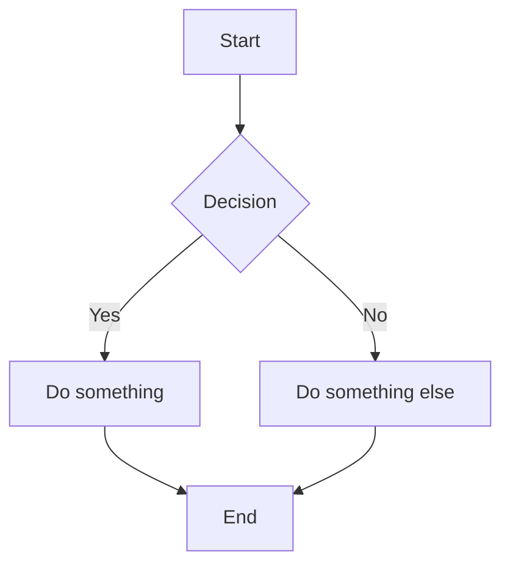

# SimpleMermaid.com

🚀 **The easiest way to create Mermaid.js diagrams** - A fast, distraction-free online editor for creating flowcharts, sequence diagrams, Gantt charts, and more with real-time preview.

## Features

✨ **No Setup Required** - Just open and start diagramming  
🔄 **Live Preview** - See your diagrams update as you type  
🎨 **Multiple Themes** - Light, dark, and colorful modes  
📱 **Mobile Friendly** - Responsive design that works on any device  
📊 **Rich Examples** - 20+ pre-loaded diagram templates organized by category  
⚡ **Modern Interface** - 2025 Bootstrap-inspired responsive design  
🔧 **Layout Options** - Vertical (code up, diagram below) or horizontal layouts

## Supported Diagram Types

- **Flowcharts** - Decision trees and process flows
- **Sequence Diagrams** - System interactions and API flows  
- **Gantt Charts** - Project timelines and scheduling
- **State Diagrams** - State machines and workflows
- **Class Diagrams** - UML and object relationships
- **Entity Relationship** - Database schemas
- **Network Diagrams** - System architecture
- **User Journey** - Experience mapping
- **Security Models** - Threat modeling and RBAC

## Quick Start

1. **Choose an Example** - Select from dropdown categories at the top
2. **Edit the Code** - Modify Mermaid syntax in the left panel  
3. **See Live Preview** - Watch your diagram update in real-time
4. **Switch Themes** - Use the theme toggle (🌙) for different color modes
5. **Change Layout** - Toggle between vertical/horizontal with the layout button (⬍)

## Example Usage



## Development

This is a single-page application built with:
- **Mermaid.js v10** - Diagram rendering engine
- **Modern CSS** - Custom properties and responsive design
- **ES6 Modules** - Clean, modular JavaScript
- **External Examples** - JSON-configured diagram templates

### Project Structure

```
X9_simplemermaid/
├── index.html          # Main application
├── examples/           # Diagram templates
│   ├── config.json    # Category configuration  
│   └── *.mmd          # Individual diagram files
├── CLAUDE.md          # Development documentation
└── README.md          # This file
```

### Local Development

1. **HTTP Server** (recommended):
   ```bash
   python -m http.server 8000
   # or
   npx serve .
   ```
   
2. **Direct File Access**:
   - Open `index.html` directly in browser
   - Uses embedded fallback examples

## Architecture

- **Theme System** - CSS custom properties with data attributes
- **Layout System** - CSS Grid with responsive breakpoints  
- **Example Loading** - Fetch API with embedded fallbacks
- **SVG Theming** - Dynamic color overrides for diagram elements

## Browser Support

- Chrome/Edge 88+
- Firefox 85+  
- Safari 14+
- Mobile browsers

## License

© 2025 SimpleMermaid.com. All rights reserved.

---

**Live Site**: [simplemermaid.com](https://simplemermaid.com)  
**Purpose**: Educational tool for learning Mermaid.js diagram syntax