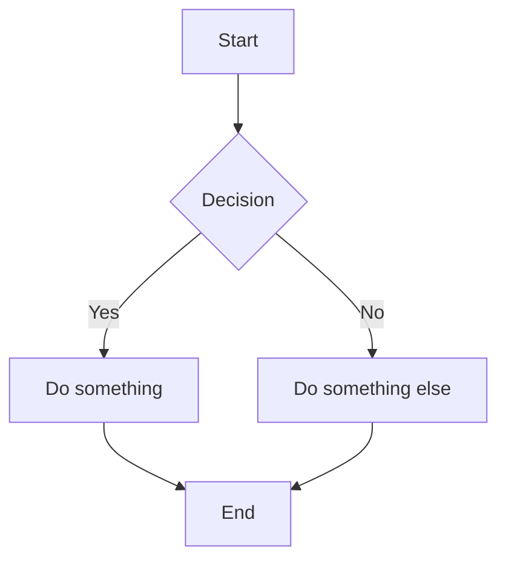

# SimpleMermaid.com

🚀 **The easiest way to create Mermaid.js diagrams** - A fast, distraction-free online editor for creating flowcharts, sequence diagrams, Gantt charts, and more with real-time preview.

## Features

✨ **No Setup Required** - Just open and start diagramming  
🔄 **Live Preview** - See your diagrams update as you type  
🎨 **Multiple Themes** - Light, dark, and colorful modes  
📱 **Mobile Friendly** - Responsive design that works on any device  
📊 **Rich Examples** - 20+ pre-loaded diagram templates organized by category  
⚡ **Modern Interface** - 2025 Bootstrap-inspired responsive design  
🔧 **Layout Options** - Vertical (code up, diagram below) or horizontal layouts

## Supported Diagram Types

- **Flowcharts** - Decision trees and process flows
- **Sequence Diagrams** - System interactions and API flows  
- **Gantt Charts** - Project timelines and scheduling
- **State Diagrams** - State machines and workflows
- **Class Diagrams** - UML and object relationships
- **Entity Relationship** - Database schemas
- **Network Diagrams** - System architecture
- **User Journey** - Experience mapping
- **Security Models** - Threat modeling and RBAC

## Quick Start

1. **Choose an Example** - Select from dropdown categories at the top
2. **Edit the Code** - Modify Mermaid syntax in the left panel  
3. **See Live Preview** - Watch your diagram update in real-time
4. **Switch Themes** - Use the theme toggle (🌙) for different color modes
5. **Change Layout** - Toggle between vertical/horizontal with the layout button (⬍)

## Example Usage



## Development

This is a single-page application built with:
- **Mermaid.js v10** - Diagram rendering engine
- **Modern CSS** - Custom properties and responsive design
- **ES6 Modules** - Clean, modular JavaScript
- **External Examples** - JSON-configured diagram templates

### Project Structure

```
X9_simplemermaid/
├── index.html          # Main application
├── examples/           # Diagram templates
│   ├── config.json    # Category configuration  
│   └── *.mmd          # Individual diagram files
├── CLAUDE.md          # Development documentation
└── README.md          # This file
```

### Local Development

1. **HTTP Server** (recommended):
   ```bash
   python -m http.server 8000
   # or
   npx serve .
   ```
   
2. **Direct File Access**:
   - Open `index.html` directly in browser
   - Uses embedded fallback examples

## Architecture

- **Theme System** - CSS custom properties with data attributes
- **Layout System** - CSS Grid with responsive breakpoints  
- **Example Loading** - Fetch API with embedded fallbacks
- **SVG Theming** - Dynamic color overrides for diagram elements

## Browser Support

- Chrome/Edge 88+
- Firefox 85+  
- Safari 14+
- Mobile browsers

## License

© 2025 SimpleMermaid.com. All rights reserved.

---

## 📝 Google Ads Implementation Todo List

### 1. Google AdSense Account Setup
- [ ] Create Google AdSense account at [adsense.google.com](https://adsense.google.com)
- [ ] Verify domain ownership for simplemermaid.com
- [ ] Add website to AdSense account
- [ ] Wait for AdSense approval (can take 1-14 days)
- [ ] Note: Site needs substantial content and traffic for approval

### 2. Ad Unit Creation
- [ ] Login to AdSense dashboard after approval
- [ ] Go to "Ads" → "By ad unit" → "Display ads"
- [ ] Create new ad unit with these settings:
  - **Name**: SimpleMermaid Banner
  - **Ad type**: Display ads
  - **Ad size**: Responsive (recommended) or 728x90 banner
  - **Ad placement**: Above content (current placeholder location)
- [ ] Copy the generated ad code

### 3. Code Implementation
- [ ] Replace the placeholder div in `index.html` at line ~2022:
  ```html
  <!-- Replace this: -->
  <div class="ad-demo">Google Ads Placeholder</div>
  
  <!-- With your AdSense code: -->
  <script async src="https://pagead2.googlesyndication.com/pagead/js/adsbygoogle.js?client=ca-pub-XXXXXXXXXX"
       crossorigin="anonymous"></script>
  <ins class="adsbygoogle"
       style="display:block"
       data-ad-client="ca-pub-XXXXXXXXXX"
       data-ad-slot="XXXXXXXXXX"
       data-ad-format="auto"
       data-full-width-responsive="true"></ins>
  <script>
       (adsbygoogle = window.adsbygoogle || []).push({});
  </script>
  ```
- [ ] Replace `ca-pub-XXXXXXXXXX` with your actual Publisher ID
- [ ] Replace `data-ad-slot="XXXXXXXXXX"` with your actual Ad Slot ID

### 4. Testing & Optimization
- [ ] Test ads on staging environment first
- [ ] Verify ads display correctly on desktop and mobile
- [ ] Check ad placement doesn't interfere with user experience
- [ ] Monitor Core Web Vitals impact (ads can slow page load)
- [ ] Test with all three themes (light/dark/colorful)

### 5. Alternative Ad Networks (if AdSense rejected)
- [ ] **Media.net** - Good alternative, especially for tech sites
- [ ] **Carbon Ads** - Developer-focused, clean ads
- [ ] **CodeFund** - Ethical ads for developers
- [ ] **BuySellAds** - Direct ad sales platform

### 6. Ad Performance Monitoring
- [ ] Set up Google Analytics enhanced events for ad impressions
- [ ] Monitor revenue per thousand impressions (RPM)
- [ ] Track click-through rates (CTR)
- [ ] Monitor user engagement metrics (bounce rate, time on site)
- [ ] A/B test ad placement if needed

### 7. Legal Compliance
- [ ] Add Privacy Policy mentioning ad tracking cookies
- [ ] Update cookie consent (if using GDPR compliance)
- [ ] Add AdSense disclosure: "This site contains affiliate links and advertisements"
- [ ] Consider adding "Advertisement" label above ads for transparency

### 8. Ad Location Notes
- **Current placement**: Above "Instant Sharing & Collaboration" section
- **CSS styling**: Matches existing design with `.ads-section` class
- **Container**: Max-width 800px, centered, responsive
- **Placeholder**: Currently shows "Google Ads Placeholder" text
- **File location**: `index.html` lines 2014-2026

### 9. Revenue Optimization Tips
- [ ] Start with responsive display ads (best performance)
- [ ] Consider adding a second ad unit in footer after traffic grows
- [ ] Monitor heatmaps to find optimal ad placement
- [ ] Test different ad sizes (300x250, 728x90, 320x50 for mobile)
- [ ] Ensure content quality remains high (affects ad rates)

### 10. Backup Plan
If ads negatively impact user experience:
- [ ] Add CSS to hide ads: `.ads-section { display: none; }`
- [ ] Remove entire ads section from HTML
- [ ] Consider donation/support model instead
- [ ] Look into minimal, developer-friendly ad networks

---

**Live Site**: [simplemermaid.com](https://simplemermaid.com)  
**Purpose**: Educational tool for learning Mermaid.js diagram syntax